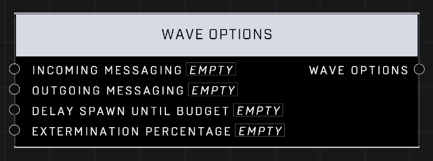

# Wave Options

## Description
Options that control a wave's messaging, whether it waits for room in the AI budget or attempts a partial spawn, and the wave's Extermination Percentage - the percentage of units that need to be killed before the wave ends.

## Node Type
Nodes fall into two basic categories: Data and Execution. This node supplies Data for an Execution node.

## Inputs
| Input            | Type             | Required | Description												    |
|------------------|------------------|----------|--------------------------------------------------------------|
| Incoming Messaging | Boolean | Yes | Whether Incoming Message plays when Wave starts spawning in. |
| Outgoing Messaging | Boolean | Yes | Whether Message plays when Wave is cleared. |
| Delay Spawn Until Budget | Boolean | Yes | If TRUE, wave will not spawn until all AI in the Wave can spawn. If FALSE, will spawn as many AI as the budget allows.|
| Extermination Percentage | Number | Yes | How many AI in the Wave must be killed before the next Wave will spawn.|

## Outputs
| Output           | Type             | Description												     |
|------------------|------------------|--------------------------------------------------------------|
| Wave Options | Wave Options | Outputs all Wave Options that are chosen in the inputs. |

\
\
**Contributors**

AddiCt3d 2CHa0s

