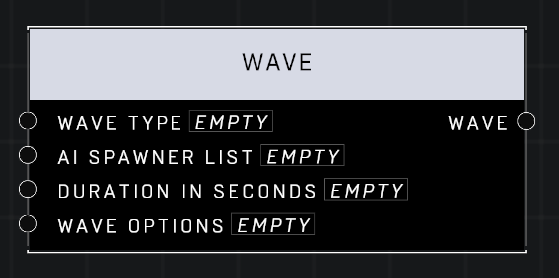

# Wave

## Description
Define a wave of AI units that spawn from a Spawner List. The wave will end once all units are killed or, if the Duration is non-zero, when enough seconds have passed. The Spawner List can be left blank for an Intermission wave which spawns no units.

## Node Type
Nodes fall into two basic categories: Data and Execution. This node supplies Data for an Execution node.

## Inputs
| Input            | Type             | Required | Description												    |
|------------------|------------------|----------|--------------------------------------------------------------|
| Wave Type | Wave Type | Yes | Defines what Type the Wave is.  |
| AI Spawner List | Object List | No | List of AI Spawners that the Wave will trigger. |
| Duration In Seconds | Number | Yes | If not 0, timer will start when Wave starts, and Wave will end when time is up. |
| Wave Options | Wave Options | Yes | Defines Wave Options for the Wave. (Incoming Messaging, Outgoing Messaging, Delay Spawn Until Budget, Extermination Percentage) |

## Outputs
| Output           | Type             | Description												     |
|------------------|------------------|--------------------------------------------------------------|
| Wave | Wave | Outputs a Wave with all options defined by this node. |

\
\
**Contributors**

AddiCt3d 2CHa0s
