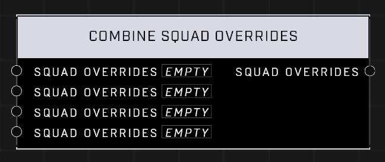

# Combine Squad Overrides

## Description
Returns a Squad Overrides containing the input Squad Overrides

## Node Type
Nodes fall into two basic categories: Data and Execution. This node supplies Data for an Execution node.

## Inputs
| Input            | Type             | Required | Description												    |
|------------------|------------------|----------|--------------------------------------------------------------|
| Squad Overrides | Squad Overrides | No | Squad Overrides that will replace default.  |
| Squad Overrides | Squad Overrides | No | Squad Overrides that will replace default.  |
| Squad Overrides | Squad Overrides | No | Squad Overrides that will replace default.  |
| Squad Overrides | Squad Overrides | No | Squad Overrides that will replace default.  |

## Outputs
| Output           | Type             | Description												     |
|------------------|------------------|--------------------------------------------------------------|
| Squad Overrides | Squad Overrides | All Squad Overrides connected to Inputs |

\
\
**Contributors**

AddiCt3d 2CHa0s