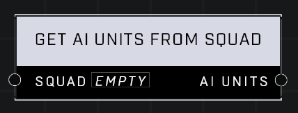

# Get AI Units From Squad

## Description
Returns a list of AI Units in the Squad that are still alive. The order of list entries is random.

## Node Type
Nodes fall into two basic categories: Data and Execution. This node supplies Data for an Execution node.

## Inputs
| Input            | Type             | Required | Description												    |
|------------------|------------------|----------|--------------------------------------------------------------|
| Squad | Squad | Yes | The Squad that the AI Units are in.  |

## Outputs
| Output           | Type             | Description												     |
|------------------|------------------|--------------------------------------------------------------|
| AI Units | Object List | List of all AI Units in Squad that are alive.						     |

\
\
**Contributors**

AddiCt3d 2CHa0s