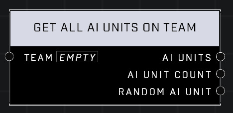

# Get All AI Units On Team

## Description
Returns all currently-spawned AI Units on the team, with options for the AI Unit Count and a Random AI Unit from the list. The order of list entries is random.

## Node Type
Nodes fall into two basic categories: Data and Execution. This node supplies Data for an Execution node.

## Inputs
| Input            | Type             | Required | Description												    |
|------------------|------------------|----------|--------------------------------------------------------------|
| Team | Team | Yes | Specify which Team to get AI Units from. |

## Outputs
| Output           | Type             | Description												     |
|------------------|------------------|--------------------------------------------------------------|
| AI Units | Object List | A list of all surviving AI Units on specified team. |

\
\
**Contributors**

AddiCt3d 2CHa0s