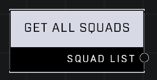

# Get All Squads

## Description
Returns a Squad List containing all currently-spawned squads. The order of list entries is random.

## Node Type
Nodes fall into two basic categories: Data and Execution. This node supplies Data for an Execution node.

## Inputs
| Input            | Type             | Required | Description												    |
|------------------|------------------|----------|--------------------------------------------------------------|
| None | N/A | N/A | N/A |

## Outputs
| Output           | Type             | Description												     |
|------------------|------------------|--------------------------------------------------------------|
| Squad List | Squad List | List of all Squads with surviving AI Units in the game.|

\
\
**Contributors**

AddiCt3d 2CHa0s