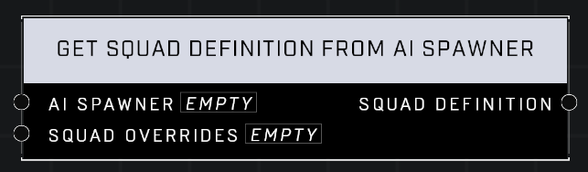

# Get Squad Definition From AI Spawner

## Description
Returns a squad definition from the _AI Spawner_, which contains unit and spawning data based off of the spawner's _Object Properties_. Optionally apply _Squad Overrides_ before returning.

## Node Type
Nodes fall into two basic categories: Data and Execution. This node supplies Data for an Execution node.

## Inputs

| Input           | Type            | Required | Description                                                  |
| --------------- | --------------- | -------- | ------------------------------------------------------------ |
| AI Spawner      | Object          | Yes      | The AI spawner object used to retrieve the squad definition. |
| Squad Overrides | Squad Overrides | No       | The squad overrides to apply to the squad definition.        |

## Outputs

| Output           | Type             | Description                                                          |
| ---------------- | ---------------- | -------------------------------------------------------------------- |
| Squad Definition | Squad Definition | The squad definition from the AI spawner with any overrides applied. |

\
\
**Contributors**

Mr. Admirals\
AddiCt3d 2CHa0s
