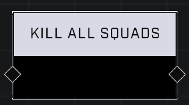

# Kill All Squads

## Description
Kills all squads on the map

## Node Type
Nodes fall into two basic categories: Data and Execution. This node Executes a function directly in the node string.

## Inputs
| Input            | Type             | Required | Description												    |
|------------------|------------------|----------|--------------------------------------------------------------|
| None | N/A | N/A | N/A |

## Outputs
| Output            | Type             | Required | Description												    |
|------------------|------------------|----------|--------------------------------------------------------------|
| None | N/A | N/A | N/A |

\
\
**Contributors**

AddiCt3d 2CHa0s