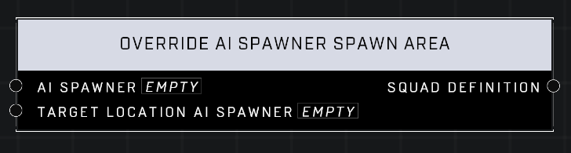

# Override AI Spawner Spawn Area

## Description
Overrides the units on a given _AI Spawner_ to return a _Squad Definition_ that can be spawned with **Spawn Squad Through Definition**_._ AI defined by the _AI Spawner_ will spawn at the location of _Target Location AI Spawner._

## Node Type
Nodes fall into two basic categories: Data and Execution. This node supplies Data for an Execution node.

## Inputs
| Input            | Type             | Required | Description												    |
|------------------|------------------|----------|--------------------------------------------------------------|
| AI Spawner | Object | Yes | The AI Spawner that will be overridden.|
| Target Location AI Spawner | Object | Yes | AI that spawn from the first input will spawn at the location of the second input.|

## Outputs
| Output           | Type             | Description |
|------------------|------------------|-------------|
| Squad Definition | Squad Definition | The squad definition from the AI spawner with overrides applied. |

\
\
**Contributors**

AddiCt3d 2CHa0s \
Okom \
Jordan9232