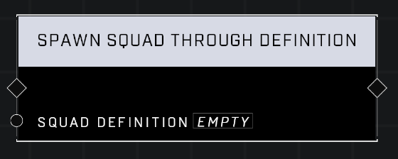

# Spawn Squad Through Definition

## Description
Spawns a Squad according to the Spawn Definition

## Node Type
Nodes fall into two basic categories: Data and Execution. This node Executes a function directly in the node string.

## Inputs
| Input            | Type             | Required | Description												    |
|------------------|------------------|----------|--------------------------------------------------------------|
| Squad Definition | Squad Definition | Yes | The Squad Definition that the spawned Squad will inherit.|

## Outputs
| Output           | Type             | Description |
|------------------|------------------|-------------|
| None | N/A | N/A |

\
\
**Contributors**

AddiCt3d 2CHa0s