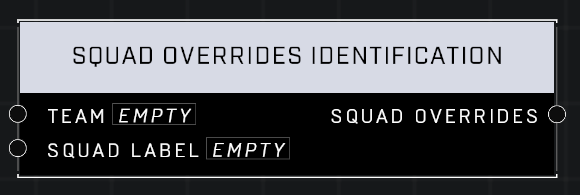

# Squad Overrides Identification

## Description
Returns Spawn Overrides for the Team and Squad Label when a squad spawns

## Node Type
Nodes fall into two basic categories: Data and Execution. This node supplies Data for an Execution node.

## Inputs
| Input            | Type             | Required | Description												    |
|------------------|------------------|----------|--------------------------------------------------------------|
| Team | Team| No | The team to put Squad on. |
| Squad Label | Squad Label | No | The Squad Label to assign to Squad.. |

## Outputs
| Output           | Type             | Description												     |
|------------------|------------------|--------------------------------------------------------------|
| Squad Overrides | Squad Overrides | Replaces squad's default Team and Squad Label with these overrides.

\
\
**Contributors**

AddiCt3d 2CHa0s