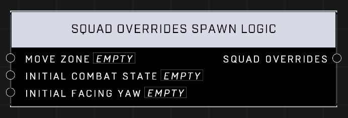

# Squad Overrides Spawn Logic

## Description
Returns Squad Overrides for the assigned Move Zone, Initial Combat State, and Initial Facing Yaw in degrees when a squad spawns

## Node Type
Nodes fall into two basic categories: Data and Execution. This node supplies Data for an Execution node.

## Inputs
| Input            | Type             | Required | Description												    |
|------------------|------------------|----------|--------------------------------------------------------------|
| Move Zone | Move Zone | No | The Move Zone squad will move to. |
| Initial Combat State | Combat State | No | Which Combat State squad will spawn in using. |
| Initial Facing Yaw | Vector 3 | No | Which direction the squad will spawn in facing. |

## Outputs
| Output           | Type             | Description												     |
|------------------|------------------|--------------------------------------------------------------|
| Squad Overrides | Squad Overrides | All Squad Overrides set in Inputs. |

\
\
**Contributors**

AddiCt3d 2CHa0s
