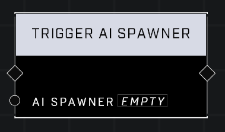

# Trigger AI Spawner

## Description
Spawns a squad from the *AI Spawner* based off its *Object Properties*.

## Node Type
Nodes fall into two basic categories: Data and Execution. This node Executes a function directly in the node string.

## Inputs
| Input            | Type             | Required | Description												    |
|------------------|------------------|----------|--------------------------------------------------------------|
| AI Spawner | AI Spawner | Yes | The AI spawner object that will be used to spawn a Squad.  |

## Outputs
| Output           | Type             | Description |
|------------------|------------------|-------------|
| None | N/A | N/A | N/A |

\
\
**Contributors**

Mr. Admirals\
AddiCt3d 2CHa0s