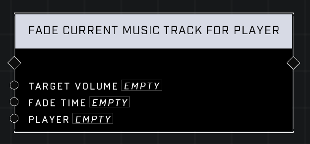

# Fade Current Music Track For Player

## Description
Fades the currently playing music track for a given player.

## Node Type
Nodes fall into two basic categories: Data and Execution. This node Executes a function directly in the node string.

## Inputs
| Input            | Type             | Required | Description												    |
|------------------|------------------|----------|--------------------------------------------------------------|
| Target Volume | Number (1-10)| Yes | How loud the music will play after fading in.|
| Fade Time | Number (0.00-1,000.00)| Yes | How long it takes music to get to full volume.|
| Player | Player | Yes | Which player to play the music for.|

## Outputs
| Output           | Type             | Description												     |
|------------------|------------------|--------------------------------------------------------------|
| (none) | N/A  | N/A  |

\
\
**Contributors**

AddiCt3d 2CHa0s
