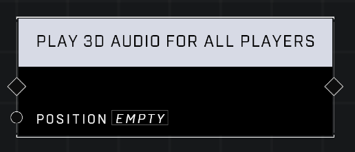

# Play 3D Audio For All Players

## Description
Plays a 3D audio clip audible to all players within range of the Position.

## Node Type
Nodes fall into two basic categories: Data and Execution. This node Executes a function directly in the node string.

## Inputs
| Input            | Type             | Required | Description												    |
|------------------|------------------|----------|--------------------------------------------------------------|
| Position | Vector3 | Yes | Location from which sound will play.|

## Outputs
| Output           | Type             | Description												     |
|------------------|------------------|--------------------------------------------------------------|
| (none) | N/A  | N/A  |

\
\
**Contributors**

AddiCt3d 2CHa0s
