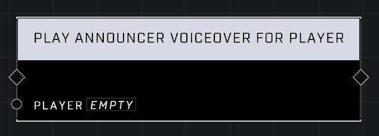

# Play Announcer Voiceover For Player

## Description
Plays an Announcer voiceover line for given player. The voiceover line is selected in the Object Properties menu.

## Node Type
Nodes fall into two basic categories: Data and Execution. This node Executes a function directly in the node string.

## Inputs
| Input            | Type             | Required | Description												    |
|------------------|------------------|----------|--------------------------------------------------------------|
| Player | Player | Yes | Which player Announcer voiceover plays for. |

## Outputs
| Output           | Type             | Description												     |
|------------------|------------------|--------------------------------------------------------------|
| (none) | N/A  | N/A  |

\
\
**Contributors**

AddiCt3d 2CHa0s

