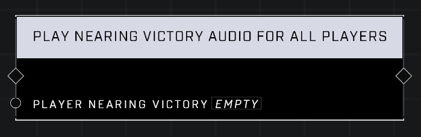

# Play Nearing Victory Audio For All Players

## Description
Plays a VO to all players announcing that Player Nearing Victory is nearing victory. Also plays the music that usually plays with the VO in standard game modes.

## Node Type
Nodes fall into two basic categories: Data and Execution. This node Executes a function directly in the node string.

## Inputs
| Input            | Type             | Required | Description												    |
|------------------|------------------|----------|--------------------------------------------------------------|
| Player Nearing Victory | Player | Yes | Player that is nearing victory.|

## Outputs
| Output           | Type             | Description												     |
|------------------|------------------|--------------------------------------------------------------|
| (none) | N/A  | N/A  |

\
\
**Contributors**

AddiCt3d 2CHa0s
