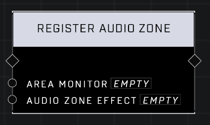

# Register Audio Zone

## Description
Registers an Area Monitor as an Audio Zone. Audio Zones apply an Audio Effect to players inside their Boundary, affecting how those players hear other sounds in game. Audio Zones can only have one Audio Effect active at a time.

## Node Type
Nodes fall into two basic categories: Data and Execution. This node Executes a function directly in the node string.

## Inputs
| Input            | Type             | Required | Description												    |
|------------------|------------------|----------|--------------------------------------------------------------|
| Area Monitor | Area Monitor | Yes | Area Monitor that will apply the effect for players in it's zone.|
| Audio Zone Effect | Audio | Yes | What audio effect will apply to players in the zone.|

## Outputs
| Output           | Type             | Description												     |
|------------------|------------------|--------------------------------------------------------------|
| (none) | N/A  | N/A  |

\
\
**Contributors**

AddiCt3d 2CHa0s