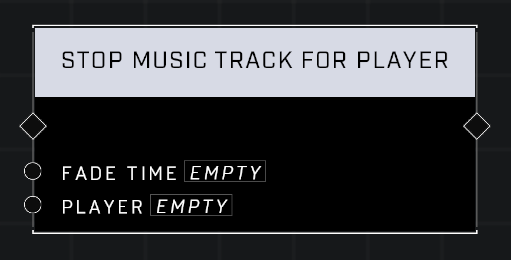

# Stop Music Track For Player

## Description
Stops the currently playing music track for a given player.

## Node Type
Nodes fall into two basic categories: Data and Execution. This node Executes a function directly in the node string.

## Inputs
| Input            | Type             | Required | Description												    |
|------------------|------------------|----------|--------------------------------------------------------------|
| Fade Time | Number (0.00-1,000.00)| Yes | How long it takes music to fade out to zero volume.|
| Player | Player| Yes | Which player the music track stops for.|

## Outputs
| Output           | Type             | Description												     |
|------------------|------------------|--------------------------------------------------------------|
| (none) | N/A  | N/A  |

\
\
**Contributors**

AddiCt3d 2CHa0s
