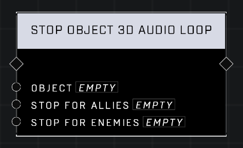

# Stop Object 3D Audio Loop

## Description
Stops the audio loop currently playing on the Object. Can stop sounds playing for allied or opposing players independently.

## Node Type
Nodes fall into two basic categories: Data and Execution. This node Executes a function directly in the node string.

## Inputs
| Input            | Type             | Required | Description												    |
|------------------|------------------|----------|--------------------------------------------------------------|
| Object | Object | Yes | Which object is used to play the audio at it's location.|
| Stop For Allies | Boolean | Yes | Whether or not the audio will top for allies of the object's team.|
| Stop For Enemies | Boolean | Yes | Whether or not the audio will stop for enemies of the object's team.|

## Outputs
| Output           | Type             | Description												     |
|------------------|------------------|--------------------------------------------------------------|
| (none) | N/A  | N/A  |

\
\
**Contributors**

AddiCt3d 2CHa0s
