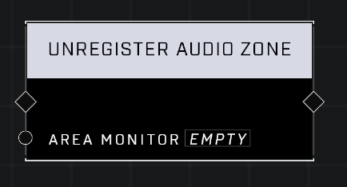

# Unregister Audio Zone

## Description
Unregisters an Area Monitor as an Audio Zone so that it no longer applies Audio Effects to players in its Boundary. When the zone is unregistered, it will remove its audio effect on any players standing in its Boundary.

## Node Type
Nodes fall into two basic categories: Data and Execution. This node Executes a function directly in the node string.

## Inputs
| Input            | Type             | Required | Description												    |
|------------------|------------------|----------|--------------------------------------------------------------|
| Area Monitor | Area Monitor | Yes | Area Monitor that will stop applying audio effect to players in it's zone.|

## Outputs
| Output           | Type             | Description												     |
|------------------|------------------|--------------------------------------------------------------|
| (none) | N/A  | N/A  |

\
\
**Contributors**

AddiCt3d 2CHa0s
