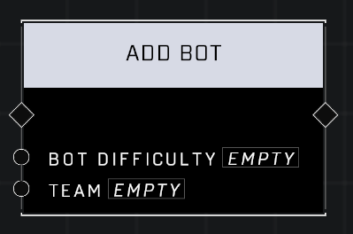

# Add Bot

## Description
Adds a bot of the given *Bot Difficulty* to the *Team*. The *Team* pin is ignored in Free-For-All games. REMINDER: Remember to bake Nav Mesh in the Build Menu to allow bots to navigate your map.

## Node Type
Nodes fall into two basic categories: Data and Execution. This node Executes a function directly in the node string.

## Inputs
| Input            | Type             | Required | Description												    |
|------------------|------------------|----------|--------------------------------------------------------------|
| Bot Difficulty | Bot Difficulty | Yes | What difficulty level the bot is (Marine, ODST, Recruit, Spartan). |
| Team | Team | Yes | What team the bot will be a part of.|

## Outputs
| Output           | Type             | Description												     |
|------------------|------------------|--------------------------------------------------------------|
| (none) | N/A  | N/A  |

\
\
**Contributors**

AddiCt3d 2CHa0s