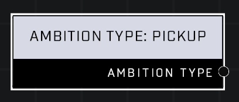

# Ambition Type: Pickup

## Description
When pursuing this behavior, a bot will try to locate the target object, pick it up, and hold it. Only works on objective items (Oddball, Flag, etc.)

## Node Type
Nodes fall into two basic categories: Data and Execution. This node supplies Data for an Execution node.

## Inputs
| Input            | Type             | Required | Description												    |
|------------------|------------------|----------|--------------------------------------------------------------|
| (none) | N/A  | N/A  | |

## Outputs
| Output           | Type             | Description												     |
|------------------|------------------|--------------------------------------------------------------|
| Ambition Type | Ambition Type  | This node passes the Pickup Ambition Type to an Execution node.  |

\
\
**Contributors**

AddiCt3d 2CHa0s

