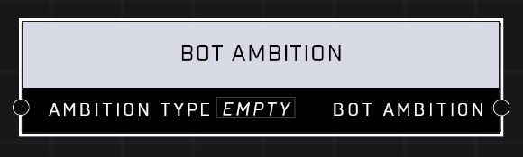

# Bot Ambition

## Description
Defines a **Bot Ambition** of the specified *Ambition Type*.

## Node Type
Nodes fall into two basic categories: Data and Execution. This node Executes a function directly in the node string.

## Inputs
| Input            | Type             | Required | Description												    |
|------------------|------------------|----------|--------------------------------------------------------------|
| Target Object | Object | Yes | Which Object will have Bot Ambition. |
| Bot Ambition | Bot Ambition | Yes | What type of Ambition object will get (Deliver, Target, Interact, Pickup) |
| Team | Team | No | Only bots on this team will respond to the ambition.|

## Outputs
| Output           | Type             | Description												     |
|------------------|------------------|--------------------------------------------------------------|
| (none) | N/A  | N/A  |

\
\
**Contributors**

AddiCt3d 2CHa0s

