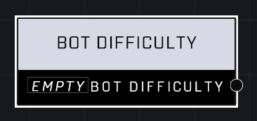

# Bot Difficulty

## Description
Returns a bot difficulty level. *Recruit* is the weakest, and *Spartan* is the strongest.

## Node Type
Nodes fall into two basic categories: Data and Execution. This node supplies Data for an Execution node.

## Inputs
| Input            | Type             | Required | Description												    |
|------------------|------------------|----------|--------------------------------------------------------------|
| (none) | N/A  | N/A  | |

## Outputs
| Output           | Type             | Description												     |
|------------------|------------------|--------------------------------------------------------------|
| Bot Difficulty | Bot Difficulty  | Applies Difficulty to a bot that will be spawned (Marine, ODST, Recruit, Spartan) |

\
\
**Contributors**

AddiCt3d 2CHa0s