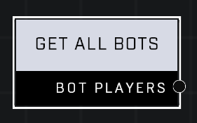

# Get All Bots

## Description
Returns a list of all players who are bots.

## Node Type
Nodes fall into two basic categories: Data and Execution. This node supplies Data for an Execution node.

## Inputs
| Input            | Type             | Required | Description												    |
|------------------|------------------|----------|--------------------------------------------------------------|
| (none) | N/A | N/A  | |

## Outputs
| Output           | Type             | Description												     |
|------------------|------------------|--------------------------------------------------------------|
| Bot Players | Object List  | Returns all bots currently in game. |

\
\
**Contributors**

AddiCt3d 2CHa0s

