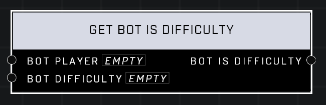

# Get Bot Is Difficulty

## Description
Returns true if the *Bot Player* matches the given *Bot Difficulty*. Always returns false if the *Bot Player* is not actually a bot.

## Node Type
Nodes fall into two basic categories: Data and Execution. This node supplies Data for an Execution node.

## Inputs
| Input            | Type             | Required | Description												    |
|------------------|------------------|----------|--------------------------------------------------------------|
| Bot Players | Object  | Yes | Which bot to check Difficulty. |
| Bot Difficulty | Bot Difficulty  | Yes | Which Difficulty to compare if it's the same as the bot. |

## Outputs
| Output           | Type             | Description												     |
|------------------|------------------|--------------------------------------------------------------|
| Bot Is Difficulty | Boolean | Returns true if bot's difficulty matches.  |

\
\
**Contributors**

AddiCt3d 2CHa0s