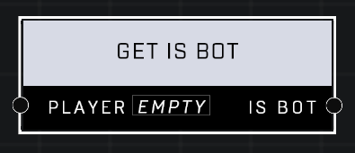

# Get Is Bot

## Description
Returns true if the *Player* is a multiplayer bot.

## Node Type
Nodes fall into two basic categories: Data and Execution. This node supplies Data for an Execution node.

## Inputs
| Input            | Type             | Required | Description												    |
|------------------|------------------|----------|--------------------------------------------------------------|
| Player | Player  | True | Which Unit to check if it's a bot |

## Outputs
| Output           | Type             | Description												     |
|------------------|------------------|--------------------------------------------------------------|
| Is Bot | Boolean | TRUE if Unit is a bot, FALSE if not.  |

\
\
**Contributors**

AddiCt3d 2CHa0s