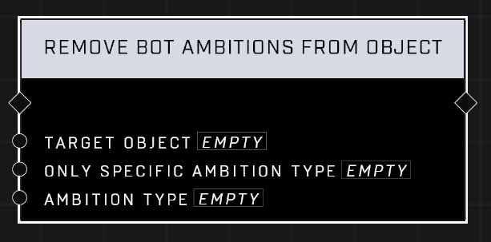

# Remove Bot Ambitions From Object

## Description
Clears all ambitions from the *Target Object* for all teams. If *Only Specific Ambition Type* is set, only ambitions that match the *Ambition Type* will be removed.

## Node Type
Nodes fall into two basic categories: Data and Execution. This node Executes a function directly in the node string.

## Inputs
| Input            | Type             | Required | Description												    |
|------------------|------------------|----------|--------------------------------------------------------------|
| Target Object | Object | Yes | Which Object will have Bot Ambition removed. |
| Only Specific Ambition Type | Boolean | Yes | Whether or not to only remove a specific Ambition Type |
| Ambition Type | Ambition Type | No | Only this Ambition Type will be removed if the above is TRUE.|

## Outputs
| Output           | Type             | Description												     |
|------------------|------------------|--------------------------------------------------------------|
| (none) | N/A  | N/A  |

\
\
**Contributors**

AddiCt3d 2CHa0s
