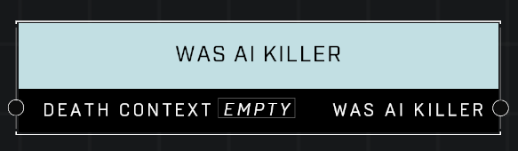

# Was AI Killer

## Description
Queries a *DeathContext* from the **On Player Killed** or **On AI Unit Killed** event. Returns true if the killing unit was an AI.

## Node Type
Nodes fall into two basic categories: Data and Execution. This node supplies Data for an Execution node.

## Inputs
| Input            | Type             | Required | Description												    |
|------------------|------------------|----------|--------------------------------------------------------------|
| Death Context | Death Context | True | Which Death Context to check killer from. |

## Outputs
| Output           | Type             | Description												     |
|------------------|------------------|--------------------------------------------------------------|
| Was AI Killer | Boolean | TRUE if Unit that was killer was an AI.  |

\
\
**Contributors**

AddiCt3d 2CHa0s
