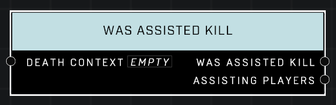

# Was Assisted Kill

## Description
Queries a *DeathContext* from the **On Player Killed** or **On AI Unit Killed** event. Returns true if other players assisted in the kill.

## Node Type
Nodes fall into two basic categories: Data and Execution. This node supplies Data for an Execution node.

## Inputs
| Input            | Type             | Required | Description												    |
|------------------|------------------|----------|--------------------------------------------------------------|
| Death Context | Death Context | True | Which Death Context to check if kill was an assist. |

## Outputs
| Output           | Type             | Description												     |
|------------------|------------------|--------------------------------------------------------------|
| Was Assisted Kill| Boolean | TRUE if another Unit also did damage to the Unit that was killed. |
| Assisting Players| Object List | If kill was assisted, list of assisting Units outputs here. |

\
\
**Contributors**

AddiCt3d 2CHa0s
