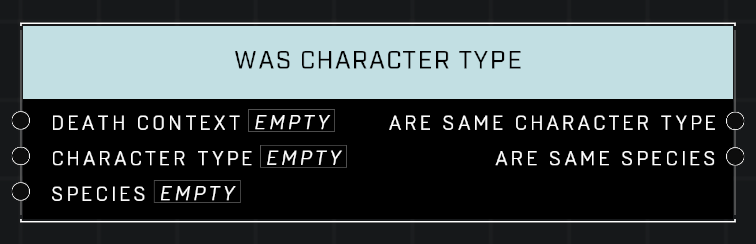

# Was Character Type

## Description
Queries a *DeathContext* from the **On Player Killed** or **On AI Unit Killed** event. Checks if the dead AI unit's *Character Type* and *Species* match the specified input.

## Node Type
Nodes fall into two basic categories: Data and Execution. This node supplies Data for an Execution node.

## Inputs
| Input            | Type             | Required | Description												    |
|------------------|------------------|----------|--------------------------------------------------------------|
| Death Context | Death Context | True | Which Death Context to check if kill was an assist. |
| Character Type | Character Type | True | Checks if killed unit was this Character Type |
| Species | Species | True | Checks if killed unit was this Species. |

## Outputs
| Output           | Type             | Description												     |
|------------------|------------------|--------------------------------------------------------------|
| Are Same Character Type | Boolean | TRUE if killed Unit matches given Character Type. |
| Are Same Species | Boolean | TRUE if killed Unit matches given Species. |

\
\
**Contributors**

AddiCt3d 2CHa0s

