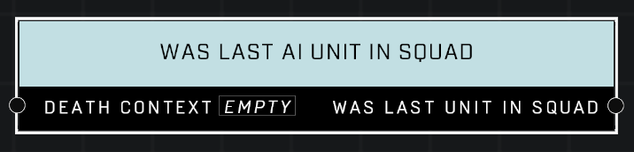

# Was Last AI Unit In Squad

## Description
Queries a *DeathContext* from the **On Player Killed** or **On AI Unit Killed** event. Returns true if the dead AI unit was the last member of its squad.

## Node Type
Nodes fall into two basic categories: Data and Execution. This node supplies Data for an Execution node.

## Inputs
| Input            | Type             | Required | Description												    |
|------------------|------------------|----------|--------------------------------------------------------------|
| Death Context | Death Context | True | Which Death Context to check if killed was last AI in their squad. |

## Outputs
| Output           | Type             | Description												     |
|------------------|------------------|--------------------------------------------------------------|
| Was Last Unit In Squad | Boolean | TRUE if killed was last AI unit. |

\
\
**Contributors**

AddiCt3d 2CHa0s

