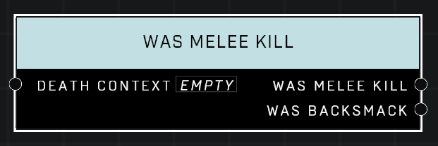

# Was Melee Kill

## Description
Queries a *DeathContext* from the **On Player Killed** or **On AI Unit Killed** event. Returns true if the killing blow came from a melee damage source.

## Node Type
Nodes fall into two basic categories: Data and Execution. This node supplies Data for an Execution node.

## Inputs
| Input            | Type             | Required | Description												    |
|------------------|------------------|----------|--------------------------------------------------------------|
| Death Context | Death Context | True | Which Death Context to check if kill was a melee. |

## Outputs
| Output           | Type             | Description												     |
|------------------|------------------|--------------------------------------------------------------|
| Was Melee Kill| Boolean | TRUE if kill was caused by a melee attack. |
| Was Backsmack | Boolean | True if kill was an assassination. |

\
\
**Contributors**

AddiCt3d 2CHa0s
