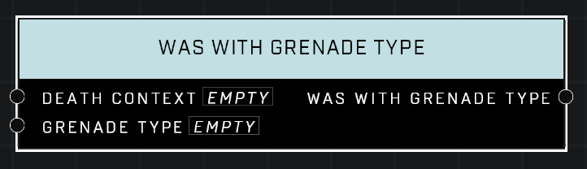

# Was With Grenade Type

## Description
Queries a *DeathContext* from the **On Player Killed** or **On AI Unit Killed** event. Returns true if the killing blow came from a matching Grenade Type.

## Node Type
Nodes fall into two basic categories: Data and Execution. This node supplies Data for an Execution node.

## Inputs
| Input            | Type             | Required | Description												    |
|------------------|------------------|----------|--------------------------------------------------------------|
| Death Context | Death Context | True | Which Death Context to check if grenade type on. |
| Grenade Type | Grenade Type | True | Which grenade type to check against, if it was this type that made the kill. |

## Outputs
| Output           | Type             | Description												     |
|------------------|------------------|--------------------------------------------------------------|
| Was With Grenade Type | Boolean | TRUE if Grenade Type that made the kill matches the given Grenade Type. |

\
\
**Contributors**

AddiCt3d 2CHa0s
