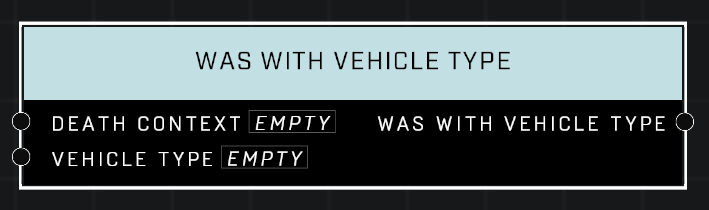

# Was With Vehicle Type

## Description
Queries a *DeathContext* from the **On Player Killed** or **On AI Unit Killed** event. Returns true if the killing blow came from a matching Vehicle Type. Unreliable if the player has left the vehicle since the kill.

## Node Type
Nodes fall into two basic categories: Data and Execution. This node supplies Data for an Execution node.

## Inputs
| Input            | Type             | Required | Description												    |
|------------------|------------------|----------|--------------------------------------------------------------|
| Death Context | Death Context | True | Which Death Context to check if kill was by given vehicle type. |
| Vehicle Type | Vehicle Type | True | Which Vehicle Type to check against. |

## Outputs
| Output           | Type             | Description												     |
|------------------|------------------|--------------------------------------------------------------|
| Was With Vehicle Type | Boolean | TRUE if kill was made with same Vehicle Type as given. |

\
\
**Contributors**

AddiCt3d 2CHa0s
