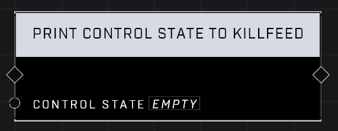

# Print Control State To Killfeed

## Description
Prints a *Control State* from a Generic Zone in the killfeed. Use this to help debug nodes in Play mode.

## Node Type
Nodes fall into two basic categories: Data and Execution. This node Executes a function directly in the node string.

## Inputs
| Input            | Type             | Required | Description												    |
|------------------|------------------|----------|--------------------------------------------------------------|
| Control State | Control State | Yes | Debug will print this to killfeed. |

## Outputs
| Output           | Type             | Description												     |
|------------------|------------------|--------------------------------------------------------------|
| (none) | N/A  | N/A  |

\
\
**Contributors**

AddiCt3d 2CHa0s