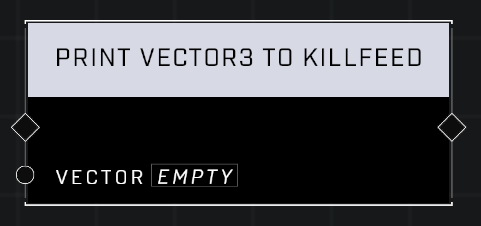

# Print Vector3 To Killfeed

## Description
Prints a *Vector3* in the killfeed with the format of [x, y, z]. Use this to help debug nodes in Play mode.

## Node Type
Nodes fall into two basic categories: Data and Execution. This node Executes a function directly in the node string.

## Inputs
| Input            | Type             | Required | Description												    |
|------------------|------------------|----------|--------------------------------------------------------------|
| Vector3 | Vector3 | Yes | Debug will print this to killfeed. |

## Outputs
| Output           | Type             | Description												     |
|------------------|------------------|--------------------------------------------------------------|
| (none) | N/A  | N/A  |

\
\
**Contributors**

AddiCt3d 2CHa0s