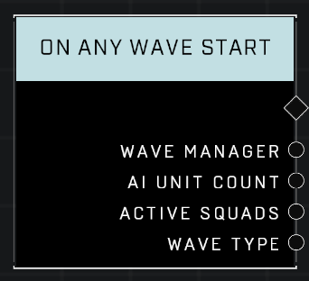

# On Any Wave Start

## Description
Event called when a wave from a Wave Manager starts. Also outputs the total AI Unit Count on the map, a list of the current Surviving Players, and a list of the wave's Active Squads.

## Node Type
Nodes fall into two basic categories: Data and Execution. This Execution node fires when something happens in the game that triggers it, and starts off the node string.

## Inputs
| Input | Type | Required | Description |
|------------------|------------------|----------|--------------------------------------------------------------|
| N/A | N/A | N/A | N/A |

## Outputs
| Output | Type | Description |
|------------------|------------------|--------------------------------------------------------------|
| Wave Manager | Wave Manager | Which Wave Manager this Wave belongs to. |
| AI Unit Count | Number | Total current AI Unit Count on the map.|
| Active Squads | Generic List | List of all of this Wave's squads.|
| Wave Type | Wave Type | Outputs Wave Type of the Wave. |

\
\
**Contributors**

AddiCt3d 2CHa0s