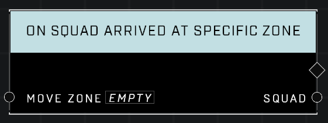

# On Squad Arrived At Specific Zone

## Description
Event called when any Squad assigned to the Move Zone finishes moving to it

## Node Type
Nodes fall into two basic categories: Data and Execution. This Execution node fires when something happens in the game that triggers it, and starts off the node string.

## Inputs
| Input | Type | Required | Description |
|------------------|------------------|----------|--------------------------------------------------------------|
| Move Zone | Move Zone | Yes | Which Move Zone is monitored for Squads arriving. |

## Outputs
| Output | Type | Description |
|------------------|------------------|--------------------------------------------------------------|
| Squad | Squad | Which Squad has arrived at the zone. |

\
\
**Contributors**

AddiCt3d 2CHa0s