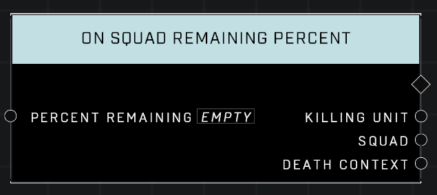

# On Squad Remaining Percent

## Description
Event called when the percent of the remaining AI units in any Squad falls to or below the specified input. The Killing Unit and Death Context are for the most recent death in that squad.

## Node Type
Nodes fall into two basic categories: Data and Execution. This Execution node fires when something happens in the game that triggers it, and starts off the node string.

## Inputs
| Input | Type | Required | Description |
|------------------|------------------|----------|--------------------------------------------------------------|
| Percent Remaining | Number | Yes | What percent of surviving AI Units to watch for in any squad.|

## Outputs
| Output | Type | Description |
|------------------|------------------|--------------------------------------------------------------|
| Killing Unit | Object | The Unit that killed the most recent AI in this squad|
| Squad | Squad | Which Squad the killed AI belongs to. |
| Death Context | Death Context | How the AI died. |

\
\
**Contributors**

AddiCt3d 2CHa0s