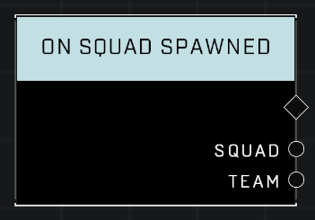

# On Squad Spawned

## Description
Event called when any Squad spawns

## Node Type
Nodes fall into two basic categories: Data and Execution. This Execution node fires when something happens in the game that triggers it, and starts off the node string.

## Inputs
| Input | Type | Required | Description |
|------------------|------------------|----------|--------------------------------------------------------------|
| N/A | N/A | N/A | N/A |

## Outputs
| Output | Type | Description |
|------------------|------------------|--------------------------------------------------------------|
| Squad | Squad | Which Squad has spawned. |
| Team | Team | What team the Squad is on.|

\
\
**Contributors**

AddiCt3d 2CHa0s