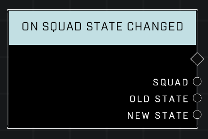

# On Squad State Changed

## Description
Event called when any Squad's combat state changes between Idle, Alert, and Active

## Node Type
Nodes fall into two basic categories: Data and Execution. This Execution node fires when something happens in the game that triggers it, and starts off the node string.

## Inputs
| Input | Type | Required | Description |
|------------------|------------------|----------|--------------------------------------------------------------|
| N/A | N/A | N/A | N/A |

## Outputs
| Output | Type | Description |
|------------------|------------------|--------------------------------------------------------------|
| Squad | Squad | Which Squad's State has changed. |
| Old State | Squad State | What Squad State the Squad was in before it changed. (Idle, Alert, or Active) |
| New State | Squad State | What Squad State the Squad has changed to. (Idle, Alert, or Active) |

\
\
**Contributors**

AddiCt3d 2CHa0s