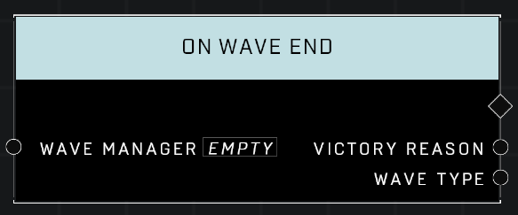

# On Wave End

## Description
Event called when a wave from the Wave Manager ends. Also outputs the Victory Reason and Elapsed Time of the wave.

*Note: This is the default description for this node, but it does not output Elapsed Time.*

## Node Type
Nodes fall into two basic categories: Data and Execution. This Execution node fires when something happens in the game that triggers it, and starts off the node string.

## Inputs
| Input | Type | Required | Description |
|------------------|------------------|----------|--------------------------------------------------------------|
| Wave Manager | Wave Manager | Yes | The Wave Manager to monitor Wave End for. |

## Outputs
| Output | Type | Description |
|------------------|------------------|--------------------------------------------------------------|
| Victory Reason | Victory Reason | Why the Wave ended. (Custom 1-8, Extermination, Duration) |
| Wave Type | Wave Type | Outputs Wave Type of the Wave. |

\
\
**Contributors**

AddiCt3d 2CHa0s