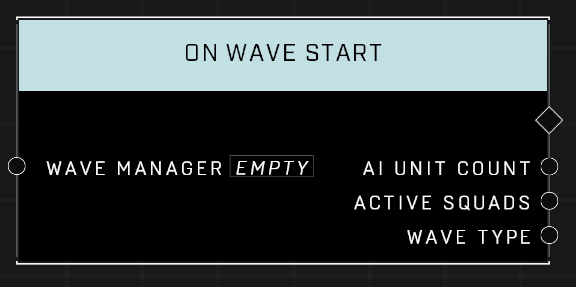

# On Wave Start

## Description
Event called when a wave from the Wave Manager starts. Also outputs the total original AI Unit Count in the wave, a list of the current Surviving Players, a list of the wave's Active Squads, and the Wave Type.

## Node Type
Nodes fall into two basic categories: Data and Execution. This Execution node fires when something happens in the game that triggers it, and starts off the node string.

## Inputs
| Input | Type | Required | Description |
|------------------|------------------|----------|--------------------------------------------------------------|
| Wave Manager | Wave Manager | Yes | The Wave Manager to monitor Wave Start for. |

## Outputs
| Output | Type | Description |
|------------------|------------------|--------------------------------------------------------------|
| AI Unit Count | Number | Total original AI Unit Count in the Wave. |
| Active Squads | Generic List | Squads from this wave that have surviving AI Units in the game. |
| Wave Type | Wave Type | Outputs Wave Type of the Wave. |

\
\
**Contributors**

AddiCt3d 2CHa0s