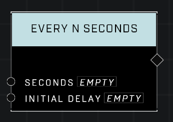

# Every N Seconds

## Description
Waits for the Initial Delay and then executes connected functions every time the number of Seconds elapses. WARNING! Setting Seconds to 0 will allow continuous execution but may negatively affect performance. Use with care.

## Node Type
Nodes fall into two basic categories: Data and Execution. This Execution node fires when something happens in the game that triggers it, and starts off the node string.

## Inputs
| Input | Type | Required | Description |
|------------------|------------------|----------|--------------------------------------------------------------|
| Seconds | Number | Yes | How often this Event node fires. |
| Initial Delay | Number | Yes | How long to wait before this node starts it's repeat firing. |

## Outputs
| Output | Type | Description |
|------------------|------------------|--------------------------------------------------------------|
| (none) | N/A  | N/A  |

---
## Learn More About This Node
If you need an "Every N Seconds" event to fire more frequently than the 0.10 second limit present on the node, you can use a workaround by passing a number from another node into the Seconds pin.

If you set the value to 0 this way, it will fire at tick rate, which can vary both during a game and between modes. 4v4 modes simulate at 60hz, while BTB simulates at 30Hz, in matchmaking, for instance.

By dividing two numbers, you can pass any quotient refresh rate you want it to run at. However, be aware that if you set it too low, it may result in visual jitter and issues related to calls being exceeded that tick.

In testing, setting the refresh rate to 1/60 resulted in visual jitter and issues, while setting it to 1/59 gave the smoothest performance of scripts that relied on it to do things like set velocity.

This workaround can be useful if you need more precise control over the timing of your events in your scripts.

\
\
**Contributors**

Captain Punch\
AgentZero\
AddiCt3d 2CHa0s
