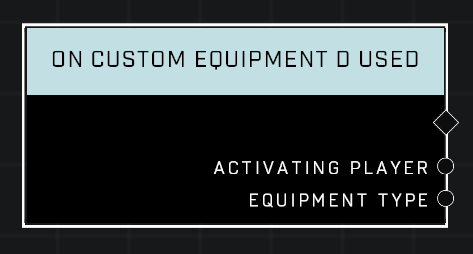

# On Custom Equipment D Used

## Description
Event called in the same conditions as **On Equipment Used** but only when the equipment used is Custom Equipment D.

## Node Type
Nodes fall into two basic categories: Data and Execution. This Execution node fires when something happens in the game that triggers it, and starts off the node string.

## Inputs
| Input | Type | Required | Description |
|------------------|------------------|----------|--------------------------------------------------------------|
| (none) | N/A | N/A | |

## Outputs
| Output | Type | Description |
|------------------|------------------|--------------------------------------------------------------|
| Activating Player | Object | Player who used the equipment. |
| Equipment Type | Equipment Type | Which type of Equipment player used. |

\
\
**Contributors**

AddiCt3d 2CHa0s