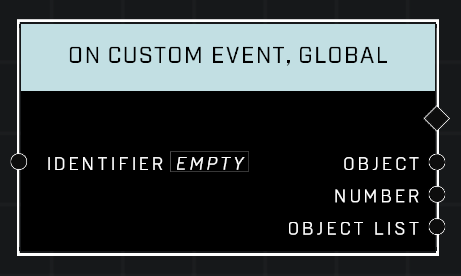

# On Custom Event, Global

## Description
Event called when **Trigger Custom Event, Global** is called from ANY script brain with a matching *Identifier*. Unless you have specific need for multiple script brains, it is always best to use the non-global version of **On Custom Event**.

## Node Type
Nodes fall into two basic categories: Data and Execution. This Execution node fires when something happens in the game that triggers it, and starts off the node string.

## Inputs
| Input | Type | Required | Description |
|------------------|------------------|----------|--------------------------------------------------------------|
| Identifier | String | Yes | Fires when Event is triggered from the same event type using same Identifier as this. |

## Outputs
| Output | Type | Description |
|------------------|------------------|--------------------------------------------------------------|
| Object | Object | Outputs an object if one is passed in through the Event. |
| Number | Number |Outputs a number if one is passed in through the Event. |
| Object List | Object List | Outputs an object list if one is passed in through the Event. |

\
\
**Contributors**

AddiCt3d 2CHa0s