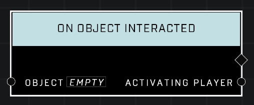

# On Object Interacted

## Description
Event called when a player interacts with the *Object*. Most commonly used with a scriptable switch.

## Node Type
Nodes fall into two basic categories: Data and Execution. This Execution node fires when something happens in the game that triggers it, and starts off the node string.

## Inputs
| Input | Type | Required | Description |
|------------------|------------------|----------|--------------------------------------------------------------|
| Object | Object | Yes | Which object to listen for interacted on. |

## Outputs
| Output | Type | Description |
|------------------|------------------|--------------------------------------------------------------|
| Activating Player | Object | Which player interacted with the object.|

\
\
**Contributors**

AddiCt3d 2CHa0s