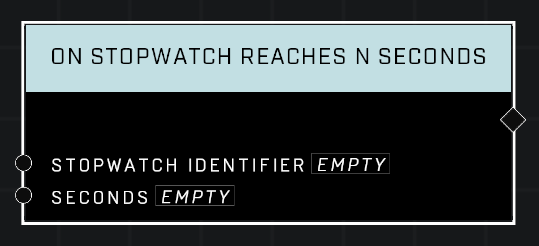

# On Stopwatch Reaches N Seconds

## Description
Event that fires each time the stopwatch with the given *Identifier* reaches the specified number of Seconds.

## Node Type
Nodes fall into two basic categories: Data and Execution. This Execution node fires when something happens in the game that triggers it, and starts off the node string.

## Inputs
| Input | Type | Required | Description |
|------------------|------------------|----------|--------------------------------------------------------------|
| Stopwatch Identifier | String | Yes | Which stopwatch to monitor. |
| Seconds | Number | Yes | How many seconds stopwatch is at before this Event will fire. |

## Outputs
| Output | Type | Description |
|------------------|------------------|--------------------------------------------------------------|
| (none) | N/A  | N/A  |

\
\
**Contributors**

AddiCt3d 2CHa0s